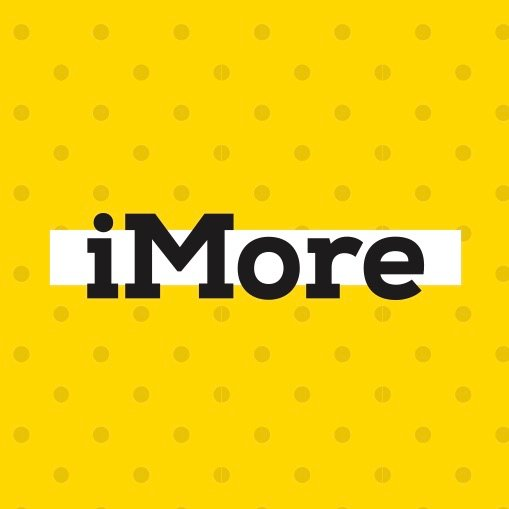
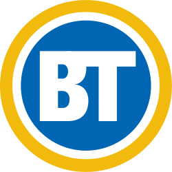

## Hello

I'm Yash, a 16 year old programmer & social entrepreneur interested in mobilizing tech to combat issues. I primarily code in Swift (for making iOS apps) but am also interested in Quantum Computing and Machine Learning.

<button class="button button1" onclick="window.location.href = '/resume-ym.pdf';">Take a look at my resumé</button>

## Press Coverage

  

    
  

  

    
  

  

    
  

  

    
  

  

    
  

## Published Apps

<table class="tg">
  <tr>
    <th class="tg-z2q5">Project </th>
    <th class="tg-w57g">Link</th>
    <th class="tg-z2q5">Description </th>
    <th class="tg-z2q5">Code </th>
  </tr>
  <tr>
    <td class="tg-w1my">Votisor</td>
    <td class="tg-w1my"><a href="http://yashmulki.me/votisor">Website</a></td>
    <td class="tg-w1my">An app for the 2019 Canadian Federal Election</td>
    <td class="tg-w1my"><a href="https://github.com/yashmulki/votisor-iOS/settings/toggle_permission">Github</a></td>
  </tr>
  <tr>
    <td class="tg-0j0p">Canada Votes</td>
    <td class="tg-0j0p"><a href="https://apps.apple.com/ca/app/canada-votes/id1379865455">iOS</a> <a href="https://play.google.com/store/apps/details?id=com.yashmulki.canadavotes&hl=en_CA">Android</a></td>
    <td class="tg-0j0p">Keeping voters informed for Canadian  Provincial &amp; Federal Elections</td>
    <td class="tg-0j0p">N/A</td>
  </tr>
  <tr>
    <td class="tg-w1my">TestPlanner</td>
    <td class="tg-w1my"><a href="https://apps.apple.com/us/app/testplanner/id1446658473">iOS</a></td>
    <td class="tg-w1my">A standardized test prep assistant</td>
    <td class="tg-w1my">N/A</td>
  </tr>
  <tr>
    <td class="tg-0j0p">Scoretrak</td>
    <td class="tg-0j0p"><a href="https://apps.apple.com/gy/app/scoretrak-free/id1188832066">iOS</a></td>
    <td class="tg-0j0p">An app to track scores in games</td>
    <td class="tg-0j0p">N/A</td>
  </tr>
</table>